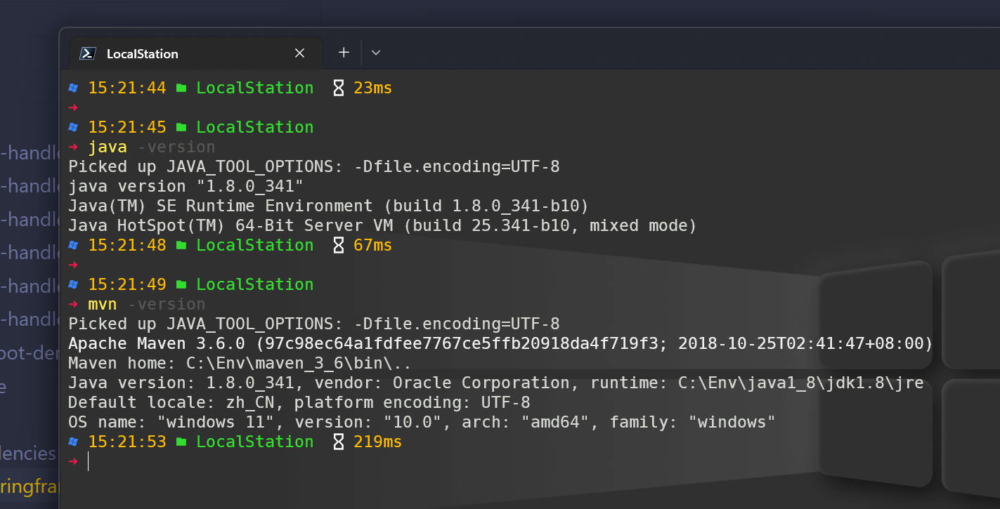
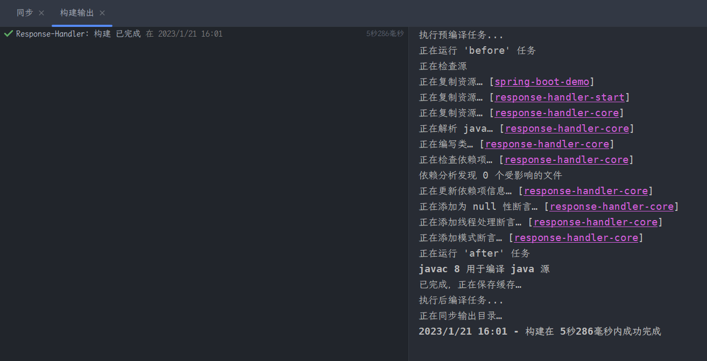

# How to contribute 👏

If you are interested in this project, you are welcome to incubate this project together, you can start from any of the following directions

- There are typos or unclear expressions in the documentation or comments
- There are security risks in the code or dependencies, or lack of checksum and other abnormal judgments
- Submit a new plugin
- Problems or pain points encountered in the actual use
- etc...

You can raise an Issue or a Pull Request (PR) [^1] for the above issue. If you're not sure how to submit a PR, here's how to do it

1. Click Fork in the upper-right corner. This step will create a repository with the same name in your GitHub repository list.
2. Make changes to the code in this same repository
3. GitHub will automatically display a PR (Pull Request) prompt

## Submit a new plugin

If you wish to create a new plugin module in order to implement your requirements. Please Fork and create a new submodule in the response-handler-plugin directory, see  [response-handler-custom-status-plugin](https://github.com/UNICKCHENG/Response-Handler/tree/main/response-handler-plugin/response-handler-custom-status-plugin), and submit a PR to [Response-Handler](https://github.com/UNICKCHENG/Response-Handler) once you have successfully modified and debugged the code locally.  
  
Note: If you need to import response-handler dependencies in your new submodule, please do not introduce response-handler-start module, but use response-handler-core or reponse-handler-*-plugin dependencies.  

```xml
<dependency>
    <groupId>io.github.unickcheng</groupId>
    <artifactId>response-handler-core</artifactId>
    <version>${project.version}</version>
</dependency>
```

## How to develop and debug code locally

The current project has two separate modules, one is response-handler and the other is spring-boot-demo. The former is responsible for implementing the current project's dependencies, while the latter is used to provide reference samples and test dependencies.


**Step 1:  Verify the local environment**

You need to download  [jdk 1.8](https://www.oracle.com/java/technologies/javase/javase8-archive-downloads.htm)  and [maven 3.x](https://archive.apache.org/dist/maven/maven-3/) and configure them in the environment variables. If you are using [IDEA](https://www.jetbrains.com/zh-cn/idea/), you can also configure it directly in IDEA



**Step 2: Clone the project and install all maven dependencies**

```bash
git clone https://github.com/UNICKCHENG/Response-Handler.git
# Install the dependencies for response-handler
mvn install -f Response-Handler/pom.xml
# Install the dependencies for demo
mvn install -f Response-Handler/spring-boot-demo/pom.xml
```

**Step 3: Start developing and verifying the code**

You can run spring boot for spring-boot-demo. Once you have modified the code in the `response-handler-*` directory, restart spring boot and it will automatically build the `response-handler` project.



If you prefer to operate from the command line, you can execute the following command in the Response-Handler root directory after you have modified the code

```bash
# Update dependency packages
mvn clean package

# Verify that the test can be run through
mvn clean test -f spring-boot-demo/pom.xml
```

If there are no errors in `mvn clean test -f spring-boot-demo/pom.xml`, feel free to mention a PR to [Response-Handler](https://github.com/UNICKCHENG/Response) after git commits to your repository of the same name. -Handler.

> Note that the `mvn clean test` error means there is a problem in your code, please check it carefully and do not use `-Dmaven.test.skip=true` to skip the test

---
> 如果你更倾向于中文

# 参与贡献 👏

如果您对这个项目感兴趣，欢迎一起来孵化这个项目，您可以从下面任何方向开始

- 文档或注释中存在错别字、表述不清晰等情况
- 代码或依赖存在安全隐患，或缺少校验等异常判断
- 提交新的插件
- 在实际使用中，碰到的问题或痛点
- 等等...

针对上面的问题您可以提个 [Issue](https://github.com/UNICKCHENG/Response-Handler/issues)，或者提个 PR（Pull Request）[^1] 。如果您不清楚如何提 PR，可以参考下面步骤
1. 点击右上角 `Fork`，这个步骤将会在您的 GitHub 仓库列表中创建同名仓库
2. 对这个同名仓库中的代码进行修改
3. 此时，GitHub 会自动出现 PR（Pull Request）提示

## 提交新的插件

如果您希望创建新的插件模块，以便实现您的需求。请 `Fork` 后，在 `response-handler-plugin` 目录下创建新的子模块，可参考 [response-handler-custom-status-plugin](https://github.com/UNICKCHENG/Response-Handler/tree/main/response-handler-plugin/response-handler-custom-status-plugin)。在本地修改和调试代码成功后，向 [Response-Handler](https://github.com/UNICKCHENG/Response-Handler) 提个 PR 即可

注意：如果在您新建的子模块中需要引入 `response-handler` 依赖，请不要引入 `response-handler-start` 模块，而是使用 `response-handler-core` 或者 `reponse-handler-*-plugin` 等依赖

```xml
<dependency>
    <groupId>io.github.unickcheng</groupId>
    <artifactId>response-handler-core</artifactId>
    <version>${project.version}</version>
</dependency>
```


## 如何在本地开发和调试代码

当前项目有两个独立的模块，一个是 response-handler，另一个是 spring-boot-demo。前者负责实现当前项目的依赖，而后者用于提供参考样例和测试依赖。

**步骤1：请确保成功配置环境**

您需要下载 [jdk 1.8](https://www.oracle.com/java/technologies/javase/javase8-archive-downloads.htm) 和 [maven 3.x](https://archive.apache.org/dist/maven/maven-3/)，并且在环境变量中进行配置。如果您使用 [IDEA](https://www.jetbrains.com/zh-cn/idea/)，也可以直接在 IDEA 中进行配置


**步骤2：克隆项目和安装所有 maven 依赖**

```bash
git clone https://github.com/UNICKCHENG/Response-Handler.git
# 安装 response-handler 所有依赖
mvn install -f Response-Handler/pom.xml
# 安装 demo 中的依赖
mvn install -f Response-Handler/spring-boot-demo/pom.xml
```

**步骤3：开始开发和验证代码**

您可以为 spring-boot-demo 启动 spring boot，一旦您修改了 `response-handler-*` 目录下的代码，请重启 spring boot，它将会自动构建 `response-handler` 项目。


如果您喜欢通过命令行操作，请您修改完代码后，可以在 Response-Handler 根目录执行下述命令

```bash
# 更新依赖包
mvn clean package

# 验证是否可以跑通测试
mvn clean test -f spring-boot-demo/pom.xml
```

如果 `mvn clean test -f spring-boot-demo/pom.xml` 没有任何错误，在 git 提交到您的同名仓库后，欢迎顺手提个 PR 到 [Response-Handler](https://github.com/UNICKCHENG/Response-Handler)。

> 注意，`mvn clean test` 报错说明您的代码中存在问题，请仔细排查，不要使用 `-Dmaven.test.skip=true` 来跳过测试


  


[^1]: https://docs.github.com/zh/pull-requests/collaborating-with-pull-requests/proposing-changes-to-your-work-with-pull-requests/creating-a-pull-request