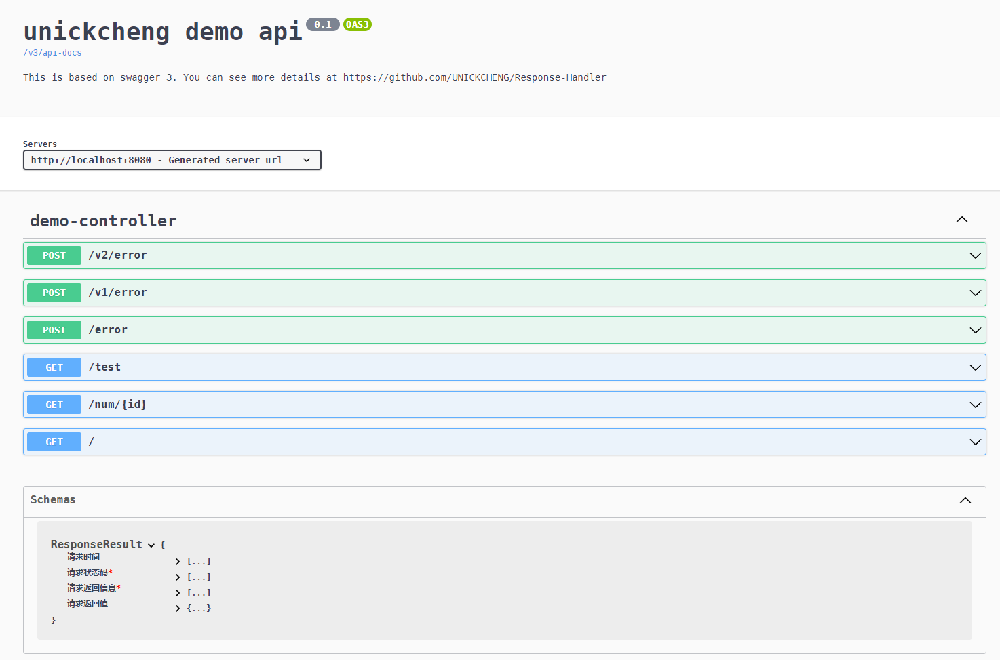

<h1 align="center">欢迎来到 Response-Handler 👋</h1>

## 更新 2023-08-29

您现在只需在 `pom.xml` 中导入下述依赖，便可实现统一封装和开启 OpenAPI 3，具体样例可参考 [spring-boot-demo](./spring-boot-demo)

```xml
<dependency>
    <groupId>io.github.unickcheng</groupId>
    <artifactId>response-handler-starter</artifactId>
    <version>0.3.0</version>
</dependency>
```

---


Response-Handler 是为 Spring 开发者提供统一的接口返回格式，您可以使用一个注解，搞定异常捕获、数据返回，以及 OpenAPI 3。 如果您对这个项目感兴趣，欢迎来一起孵化它，详细操作可见 [How to contribute](contributing.md)。


## ✨特征

- [X] 统一返回体格式
- [X] 支持自动捕获常见异常，无需在抛出异常后再手动 catch
- [X] 支持扩展自定义状态码
- [x] 内置 OpenAPI 3，即 Swagger 3 的支持
- [X] 可从 Maven 中央仓库下载 ([OSSRH-87858](https://issues.sonatype.org/projects/OSSRH/issues/OSSRH-87858))
- [ ] 支持返回数据进行加密（后期考虑使用注解来内置 AES、RSA、国密等加密方法）

## 🎉用法

您需要先在 pom.xml 中添加下述依赖，然后执行 `mvn install` 下载依赖，注意版本号可能过时，您可以在 [Maven 中央仓库](https://mvnrepository.com/artifact/io.github.unickcheng/response-handler-starter) 查看最新的版本
```xml
<dependency>
    <groupId>io.github.unickcheng</groupId>
    <artifactId>response-handler-starter</artifactId>
    <version>0.3.0</version>
</dependency>
```

> 如果您希望使用最新开发版，您可以在 pom.xml 中追加 GitHub 仓库地址。注意，使用最新开发版可能存在诸多不稳定因素
```xml
<!--添加 GitHub 仓库地址-->
<repositories>
    <repository>
        <id>unickcheng</id>
        <url>https://unickcheng.github.io/maven-packages/</url>
    </repository>
</repositories>
```

如果您不知道如何开始，您可以参考或使用 [spring-boot-demo](./spring-boot-demo) 来熟悉使用流程

## 😎 扩展玩法

### 1. 网页端查看所有接口

请网页端访问 `http://<your-ip>:8080/openapi-ui.html`，如果您的端口号不是默认的 8080，请修改



返回体结构中包含请求时间，默认时区为 `Asia/Shanghai`。因为使用的是 `@JsonFormat` 来格式化字段，所以您可以很方便地在 `application` 配置文件中进行修改，注意目前您只能修改时区

```
# @JsonFormat: set time zone  
spring.jackson.time-zone=Asia/Shanghai
```

### 2. 根据业务自定义响应体状态码信息

这一部分采用的是工厂设计模式，您只需对 `ExceptionStatusInfo` 接口进行实现，即可封装自定义状态码枚举类，之后在相应的方法内抛出自定义异常，可参考 [ReturnStatus.java](spring-boot-demo/src/main/java/cc/unickcheng/rhdemo/enums/ReturnStatus.java) 
```java
throw new RHandlerException(ReturnStatus.CUSTOM_ERROR);
```

如果您暂时没有这方面的需求，建议您使用 `org.springframework.http.HttpStatus` 作为状态码进行快速开发。简单来说，您无需增加额外的操作，只需在相应的方法内抛出类似于下述代码的异常
```java
throw new RHandlerException(HttpStatus.BAD_REQUEST);
```

## ✍️ 日志

- [CHANGELOG](CHANGELOG.md)

## 👍 其他有趣的项目

- [Sa-Token](https://github.com/dromara/sa-token)
- [encrypt-body-spring-boot-starter](https://github.com/Licoy/encrypt-body-spring-boot-starter)
- [lombok](https://github.com/projectlombok/lombok)

## 💖 感谢

- [Spring Boot](https://spring.io/projects/spring-boot) 提供的框架支持
- [开源依赖](https://github.com/UNICKCHENG/Response-Handler/network/dependencies) 提供的支持
- 感谢所有开源项目分享的想法和技术