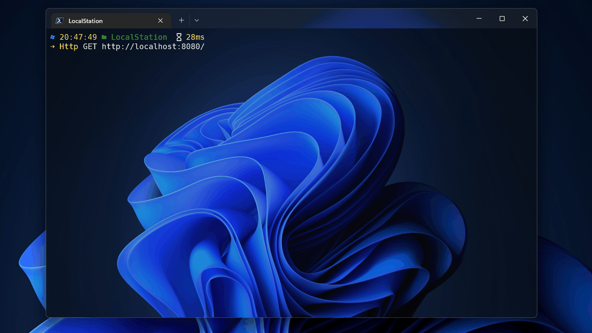

Hi, there 👇

我正在写一个 Maven 依赖，只需一个注解，就能搞定接口返回格式，以及异常处理。



## ✨特征

- [X] 统一返回体格式
- [X] 支持自动捕获常见异常，无需在抛出异常后再手动 catch
- [X] 支持扩展自定义状态码
- [x] 内置 OpenAPI 3，即 Swagger 3 的支持
- [ ] 支持返回数据进行加密
- [ ] 可从 Maven 中央仓库下载 ([OSSRH-87858](https://issues.sonatype.org/projects/OSSRH/issues/OSSRH-87858))

## 🎉用法

### 步骤1：引入依赖

您需要先在 pom.xml 中添加下述依赖，然后命令行使用 `mvn install` 进行下载
```xml
<dependency>
    <groupId>io.github.unickcheng</groupId>
    <artifactId>response-handler-core</artifactId>
    <version>0.0.1</version>
</dependency>
```
> ⚠️ASAP: 目前暂未提交到中央仓库，请在 pom.xml 中增加「GitHub 仓库地址」来获取依赖
```xml
<!--添加 GitHub 仓库地址-->
<repositories>
    <repository>
        <id>unickcheng</id>
        <url>https://unickcheng.github.io/maven-packages/</url>
    </repository>
</repositories>
```
### 步骤2：在控制器中追加注解

当您在 Controller 层增加 `@RHandlerResponseBody` 注解，将会对当前接口进行封装
```java
@RHandlerResponseBody
```

您也可以使用下面的注解, 等价于 `@RestController` + `@RHandlerResponseBody`
```java
@RHandlerController
```

如果您不知道如何开始，您可以参考或使用 [spring-boot-demo](spring-boot-demo) 来熟悉使用流程


## 😎 扩展玩法

### 1. 网页端查看所有接口

请网页端访问 `http://<your-ip>:8080/swagger-ui/index.html`


返回体结构中包含请求时间，默认时区为 `Asia/Shanghai`。因为使用的是 `@JsonFormat` 来格式化字段，所有您可以很方便地在 `application` 配置文件中进行修改，注意目前您只能修改时区。

```
# @JsonFormat: set time zone  
spring.jackson.time-zone=Asia/Shanghai
```

### 2. 根据业务自定义响应体状态码信息

可参考 [ReturnStatus.java](spring-boot-demo/src/main/java/cc/unickcheng/rhdemo/enums/ReturnStatus.java) 对 `ResponseStatus` 接口进行覆写，之后只需在相应的方法内抛出自定义异常即可
```java
throw new CommonException(ReturnStatus.CUSTOM_ERROR);
```

如果您暂时没有这方面的需求，建议您使用 `org.springframework.http.HttpStatus` 作为状态码进行快速开发。简单来说，您无需增加额外的操作，只需在相应的方法内抛出类似于下述代码的异常
```java
throw new CommonException(HttpStatus.BAD_REQUEST);
```

